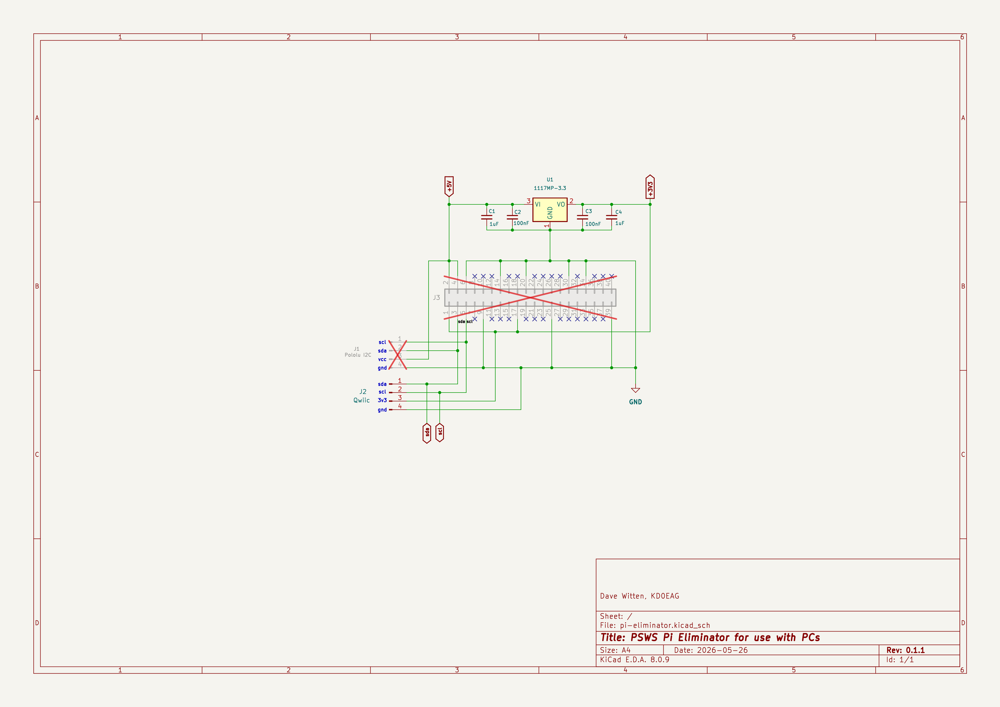
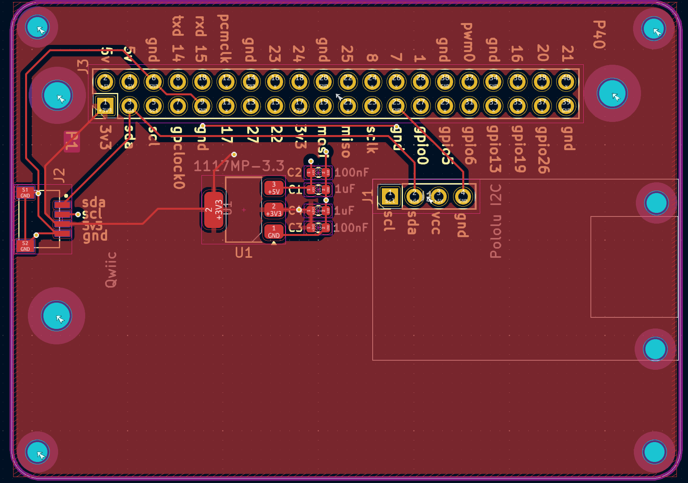

Design Specifications
=====================

The Pi-Eliminator design focuses on providing a clean interface for ADC signals and power management.

Schematic
---------

The schematic was designed in KiCad and includes protection circuitry and signal conditioning for the ADC interface.

PCB Layout
----------

The PCB is a multi-layer design optimized for signal integrity.

Key Components
--------------

* **JST SRSS Connectors**: Used for low-profile, secure connections.
* **2x20 Pin Header**: Provides Raspberry Pi compatibility.
