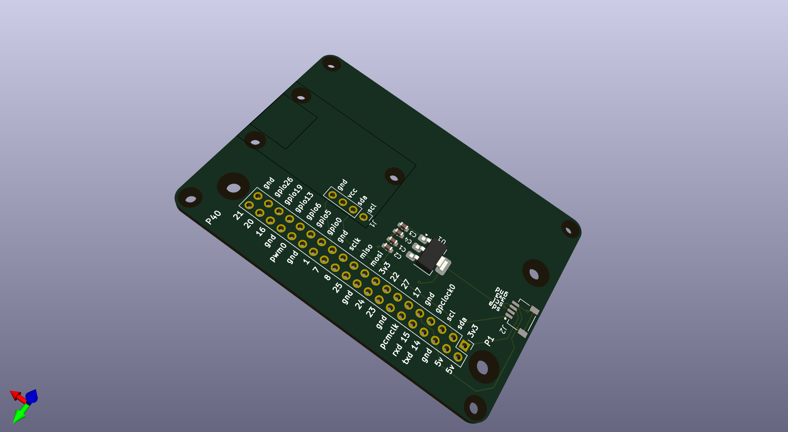

Introduction
============

The Pi-Eliminator is a hardware component designed for the Personal Space Weather Station (PSWS) project. It serves as an interface or replacement for Raspberry Pi-based setups, particularly for ground magnetometer support and SDR hardware like the ClementineSDR and projects involving the LTC2208 ADC.

Features
--------

* Standard 2x20 pin headers (Raspberry Pi compatible).
* Optimized for high-performance ADC interfacing.
* Designed using KiCad.
